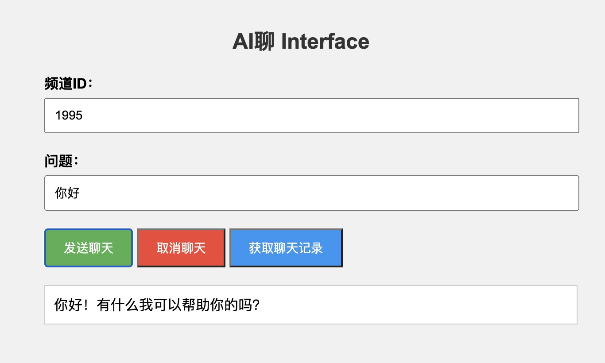

# AI聊 Interface


这是一个使用 JavaScript 和 Fetch API 实现的聊天界面的示例项目。它演示了如何使用 Fetch API 发送 POST 和 GET 请求与 ChatGPT 聊天模型进行交互，实现智能聊天功能。

该项目提供了与 ChatGPT 聊天模型轻松对接的能力，您可以通过与 ChatGPT 进行交互，观察其智能回复。


## 功能

- 发送聊天消息
- 取消聊天请求
- 获取聊天记录

## 使用方法

1. 将项目克隆到本地

```shell
git clone https://github.com/your-username/chat-interface.git'
```
2. 进入项目目录

```shell
cd chat-interface
```
3. 启动本地服务，访问index.html 文件

4. 在页面上输入频道ID和问题，并点击相应的按钮进行操作。

## 配置

在 `index.html` 文件中，您可以修改以下配置项：

您可以在[这里](https://iliao.icispace.com/developer)获取详细的配置信息。

| 配置项   | 描述           | 示例值                                          |
|----------|----------------|-------------------------------------------------|
| `apiUrl` | API 的基础 URL | https://iliao.icispace.com/api/open|
| `apiKey` | API 密钥      | oPX_181bkrw7vbdawy2eevb3g                        |

请确保在修改配置项时遵循正确的 URL 和密钥。

## 注意事项
请注意，该示例仅用于演示目的，并未涵盖完整的错误处理和安全性考虑。在实际应用中，请根据需要进行适当的错误处理和安全性验证。


